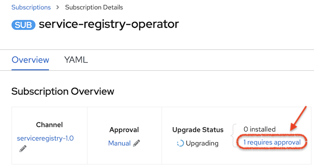
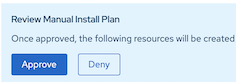
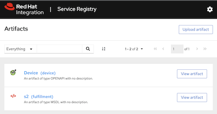
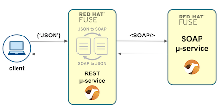

# Service Registry with Fuse REST/SOAP services

## Introduction
The recommended way to build web services is to follow an API-First approach. It ensures a contract between the client and the server is defined, and with which both parties need to be compliant.

In this tutorial, we've used *APICurio* to create an *OpenAPI* interface. It's UI is very intuitive and you can easily switch from the point & click interface to the source view where you can edit directly if you desire full control.

We've also created a WSDL definition to expose a SOAP backend service which we'll integrate with.


Normally, the interfaces (REST/SOAP) are included in the source code as part of the projects. They are used to create the JAVA structures that Fuse needs to generate/validate the data that goes in and out.

From an implementation point of view this causes no problem and still follows the API-First approach. However, they are not easily reachable to external teams. It is preferable to have a central *Service Registry* acting as the *'Source of Truth'* that keeps all interface definitions.

The focus of this small tutorial is to serve as a guide on how to configure a Fuse project to obtain its interfaces from Red Hat's *Service Registry*.

Fuse would then fetch the interfaces from the Service Registry when compiling and packaging the project to produce the deployable unit.

The picture below illustrates the different stages where API's are defined, then stored in the Service Registry, and then pulled by Maven to compile and package the project:


<br>

----

## Deploy the Service Registry


1. ### Create a new namespace

	The target environment will be *OpenShift* v4. Create a new project where the *Service Registry* will be deployed, for example, executing the following CLI command:

	```
	oc new-project service-registry
	```

1. ### Install the Service Registry Operator

	>**Reference Documentation:** \
	[https://access.redhat.com/documentation/en-us/red_hat_integration/2020-q2/html/getting_started_with_service_registry/installing-the-registry#setting-up-infinispan-storage](https://access.redhat.com/documentation/en-us/red_hat_integration/2020-q2/html/getting_started_with_service_registry/installing-the-registry#setting-up-infinispan-storage)

	As an admin, navigate to:

	- Web Console ➡ Operators ➡ OperatorHub ➡ Service Registry Operator ➡ Install

		

	Select the following options:

	* Installation Mode: A specific namespace on the cluster > [your_project]
	* Update Channel: serviceregistry-1.0
	* Approval Strategy: Manual
	
	<br>

	Click *Subscribe*

    Now you need to manually approve the installation, navigate to:

	- Web Console ➡ Installed Operators ➡ Red Hat Integration - Service Registry Operator ➡ Subscription Overview

		

		Click on the link shown above in the picture, and then on the button `Approve`

		

		


		>**Be patient:** this action may take some time as OpenShift needs to pull the Operator's image from a remote repository

1. ### Create the Service Registry

	Once the Operator is installed, you can create the Service Registry instance. Navigate to:
	
	- Web Console ➡ Installed Operators ➡ Red Hat Integration - Service Registry Operator ➡ Provided APIs ➡ ApicurioRegistry ➡ Create Instance

	<br>

	You'll be shown the YAML definition, in which we need to explicitly include the storage strategy (*Infinispan* in this example). It should look similar to:

	```yaml
	apiVersion: apicur.io/v1alpha1
	kind: ApicurioRegistry
	metadata:
	  name: example-apicurioregistry
	  namespace: service-registry
	spec:
	  configuration:
	  persistence: "infinispan"
	    infinispan:
	    clusterName: "example-apicurioregistry"
	```

	Click `Create`.


	Verify it's up and running.

	Once ready, a route should be available to access the UI for example:

	   http://example-apicurioregistry.service-registry.apps.demo.c1u7.p1.openshiftapps.com

<br>

---

## Upload Interfaces (Artifacts)

Open the UI using the route URL (previous section) in your browser.

From the UI, you can now upload the interfaces needed for the *Device* service. This tutorial project includes the interfaces in the following folder:

	registry-artifacts

where you'll find 2 APIs

- OpenApi *Device* definition
- WSDL *Fulfillment* definition

Use the following identifiers when you upload the interfaces:
- device
- fulfillment

The screenshot below illustrates the result:



<br>

---

## Configure POM files

This tutorial includes two Fuse projects:

* REST service
* SOAP service

The overview of the execution flow would be as follows:



Each project contains its own POM file. If we pick for example the REST service and inspect its POM file, you'll find the following plugin definition:

```xml
<plugin>
  <groupId>io.apicurio</groupId>
  <artifactId>apicurio-registry-maven-plugin</artifactId>
  <executions>
    <execution>
      <phase>generate-sources</phase>
      <goals>
       <goal>download</goal> 
      </goals>
      <configuration>
        <registryUrl>${service.registry.url}</registryUrl>
        <ids>
          <param1>device</param1>
          <param2>fulfillment</param2>
        </ids>
        <versions>
          <device>1</device>
          <fulfillment>1</fulfillment>
        </versions>
        <artifactExtensions>
          <device>.json</device>
          <fulfillment>.wsdl</fulfillment>
        </artifactExtensions>
        <outputDirectory>${project.build.directory}/ocp-registry</outputDirectory>
      </configuration>
    </execution>
  </executions>
</plugin>
```

In the above definition:
 - the goal `download` indicates the plugin will attempt to pull the interfaces.
 - `registryUrl` indicates the URL where the Service Registry lives.
 - `ids` indicates the Artifact IDs to be pulled.
 - `versions` indicates the versions of the interfaces.
 - `artifactExtensions` indicate the file extension to use.
 - `outputDirectory` where the interfaces should be downloaded.

 The POM file includes 2 other plugins to create the POJO classes from the respective OpenApi and WSDL definitions:

 - `camel-restdsl-swagger-plugin` to create REST based POJOs
 - `cxf-codegen-plugin` to create SOAP based POJOs 

<br>

With the above POM configuration, the project is ready to interact with the *Service Registry*. The rest of the information below provide some implementation details about the *Fuse* project, and further down you'll find some instructions on how to run them.

<br>

---

## JSON to SOAP with *AtlasMap*

In the previous section we showed how the interfaces fetched from the *Service Registry* are parsed and processed to create POJOs. *Camel* needs the JAVA objects to handle the JSON data structures as input and needs to produce SOAP data to invoke the backend.

The following section shows how the generated POJOs are used with *AtlasMap* to transform the input data to compose the backend call, and also to convert the response data back to reply to the client.

*AtlasMap* allows you to graphically define data mappings you can then execute with *Camel*. You can install in *VSCode* the *AtlasMap* extension to visually work with data mappings.

The information below will assume you have already some familiarity with *AtlasMap*. If not, you can learn how to get started with *AtlasMap* by following this tutorial:

- tutorial: [fuse-tooling-atlasmap](https://gitlab.com/rh-emea-ssa-fuse-tutorial/fuse-tooling-atlasmap#fuse-tooling-with-vscode-and-atlasmap)

<br>

## Creating AtlasMap Data mappings:

The data transformations in this tutorial use the POJOs created by the *Maven* plugins. In order to use the java objects with *AtlasMap* we need to pass a JAR file containing the related Java classes.

Run the following commands from the `rest-device` project:

```
mvn package
mv target/rest-device-1.0.0.jar.original packages.jar
```

The above commands create a JAR file `packages.jar` we will import in *AtlasMap*.

Launch the *AtlasMap* extension from *VSCode* and import the JAR file as shown in the snapshot below:


The classes are now internally loaded and ready to be used.

<br>

### JSON to SOAP mapping (request)

The request flow requires a JSON to SOAP conversion where we need to map the JSON fields from the REST request to the SOAP fields to invoke the SOAP backend (Fulfillment).

Click the `+` button in the Source (left side) panel:


and type in the source POJO class:


Now define the target (right side) POJO class:


Both Source and Target structures are visible and you can map the input fields to the output fields. The result mapping would look as follows:


The mapping can now be exported and saved in the project. The example Fuse project includes the mapping definitions under:

	rest-device/src/main/resources/map


### SOAP to JSON mapping (response)

The response flow requires the reverse conversion (SOAP to JSON) where we need to map the SOAP data into JSON data to return the response to the client.

The source POJO class would be:


Now define the target (right side) POJO class:


The result mapping for the response flow would look as follows:


<br>


---

## Running the REST/SOAP services

You can deploy the example services in OpenShift, but for simplicity, we'll show you how to run them in your local environment. Further down you'll find some guidelines on how to deploy in OpenShift.

To run the example *Fuse* services, ensure you've deployed the *Service Registry* as indicated in previous sections in the tutorial. *Fuse* will depend on the *Service Registry* to download the API contracts.

1. Clone the repository

       git clone https://gitlab.com/rh-emea-ssa-fuse-tutorial/fuse-service-registry.git

2. Configure the SOAP backend

	Edit the pom file under:

	   soap-fulfillment/pom.xml

	and ensure the following property is referencing your deployed *Service Registry* in OpenShift

	```xml
    <properties>
        ...
        <!-- URL where the Service Registry lives -->
        <service.registry.url>http://example-apicurioregistry.service-registry.apps.demo.c1u7.p1.openshiftapps.com/api</service.registry.url>
    </properties>
	```

1. Run the SOAP service locally

	From the `soap-fulfillment` project, run the following command to start the service:

	   mvn

	This action will trigger the *Maven* plugin to pull the WSDL interface from the *Service Registry*, then compile, and run the instance locally.

1. Configure the REST service

	Edit the pom file under:

	   rest-device/pom.xml

	and ensure the following property is referencing your deployed Service Registry in OpenShift

	```xml
    <properties>
        ...
        <!-- URL where the Service Registry lives -->
        <service.registry.url>http://example-apicurioregistry.service-registry.apps.demo.c1u7.p1.openshiftapps.com/api</service.registry.url>
    </properties>
	```

1. Run the REST service locally

	From the `rest-device` project, run the following command to start the service:

	   mvn

	This action will trigger the *Maven* plugin to pull the OpenApi/WSDL interfaces from the *Service Registry*, then compile, and run the instance locally.

1. Test the service.

	You can use a *Swagger* UI client to send a request. The URL to obtain the *Swagger* definition would be:

	   http://localhost:8080/camel/api-docs

	Using `curl` you can use the following command:

	```command
	curl -X POST \
	--header 'Content-Type: application/json' \
	--header 'Accept: application/json' \
	-d "
	{
	  \"callerId\": \"curl\",
	  \"msisdn\": \"012345\",
	  \"brand\": \"SmartphoneX\",
	  \"model\": \"modelY\",
	  \"color\": \"blue\",
	  \"size\": \"6in\"
	}" \
	'http://localhost:8080/camel/device/ordernew'
	```

	If all goes well, you should get a response similar to:

	```json
	{"status":"success","job-id":"0000100004"}
	```

<br>

----

## Deploying in OpenShift

If you wish to deploy the *Fuse* services in *OpenShift*, find below some useful instructions:


1. ### Install Fulfillment Service

	From the project `soap-fulfillment`, run the command:

	   mvn fabric8:deploy -Popenshift


	Verify the service is available

	   oc get pods
	   oc port-forward fulfillment-1-zwj6f 18080
	   curl http://localhost:18080/services/fulfillment?wsdl

1. ### Install Device Service

	From the project `rest-device`, run the command:

	   mvn fabric8:deploy -Popenshift

	Verify the services are available

	   oc get pods
	   oc port-forward device-1-mz4xl 8080
	   curl http://localhost:8080/camel/api-docs